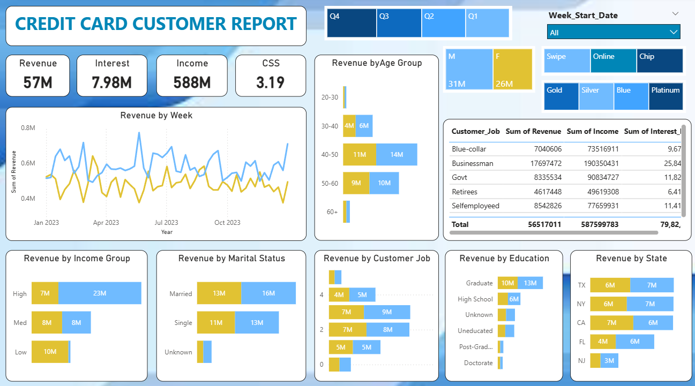

# 💳 Credit Card Financial Dashboard

> **Real-time weekly financial analytics dashboard tracking $57M in credit card revenue with 28.8% week-over-week growth**



[](https://powerbi.microsoft.com/)
[](https://www.mysql.com/)
[](https://dax.guide/)
[](https://www.microsoft.com/en-us/microsoft-365/excel)

---

## 🎯 Project Objective

To develop a **comprehensive credit card weekly dashboard** that provides **real-time insights** into key performance metrics and trends, enabling stakeholders to monitor and analyze credit card operations effectively for data-driven decision-making.

**Business Impact:**
- **$57M total revenue** tracked and analyzed weekly
- **28.8% WoW revenue growth** identified in Week 53
- **57.5% activation rate** monitored for customer engagement
- **6.06% delinquency rate** tracked for risk management
- **Real-time insights** enabling immediate business decisions

---

## 📊 Key Performance Metrics (Week 53 - Dec 31, 2023)

### **Financial Performance**

| Metric | Value | WoW Change | Business Impact |
|--------|-------|------------|-----------------|
| **Total Revenue** | $57M | ↑ 28.8% | Strong year-end performance |
| **Total Income** | $588M | - | Customer purchasing power |
| **Total Interest Earned** | $8M | - | Revenue from revolving balances |
| **Transaction Amount** | $46M | - | Core transaction revenue |
| **Customer Satisfaction** | 3.19/5 | - | Opportunity for improvement |

### **Operational Metrics**

| KPI | Value | Insight |
|-----|-------|---------|
| **Card Activation Rate** | 57.5% | Strong new customer engagement |
| **Delinquency Rate** | 6.06% | Managed credit risk level |
| **Blue & Silver Cards** | 93% | Dominant product categories |
| **Top 3 States** | 68% | TX, NY, CA revenue concentration |

---

## 📈 Dashboard Insights & Analysis

### **1. Revenue by Gender**

| Gender | Revenue | % of Total | Insight |
|--------|---------|------------|---------|
| **Male** | $31M | 54% | Higher spending power |
| **Female** | $26M | 46% | Growth opportunity segment |

**Strategic Action:** Develop targeted marketing campaigns to increase female customer spending by 10-15%, potentially adding $2.6M-$3.9M in revenue.

---

### **2. Revenue by Age Group**

| Age Bracket | Revenue | % of Total | Customer Profile |
|-------------|---------|------------|------------------|
| **60+** | $14M | 24.6% | Highest revenue - retirement savings usage |
| **30-40** | $11M | 19.3% | Peak earning years - family expenses |
| **40-50** | $10M | 17.5% | Established careers - lifestyle spending |
| **50-60** | $9M | 15.8% | Pre-retirement - wealth accumulation |
| **20-30** | $4M | 7.0% | Entry-level - credit building |

**Key Finding:** Customers aged 50+ contribute $23M (40.4% of revenue)

**Business Strategy:**
- **60+ segment:** Premium travel rewards, concierge services
- **30-50 segment:** Cashback on family/lifestyle expenses
- **20-30 segment:** Credit building tools, low-fee starter cards

---

### **3. Revenue by Income Group**

| Income Bracket | Revenue | Customer Strategy |
|----------------|---------|-------------------|
| **High (>$70K)** | $23M (40%) | Premium card upgrades, exclusive benefits |
| **Medium ($35K-$70K)** | $10M (18%) | Rewards programs, balance transfer offers |
| **Low (<$35K)** | $15M (26%) | Fee waivers, credit education programs |

**Insight:** High-income segment generates 40% of revenue - focus retention efforts here.

---

### **4. Revenue by Customer Job Type**

| Occupation | Revenue | Total Income | Interest Earned | Strategy |
|------------|---------|--------------|-----------------|----------|
| **Businessman** | $17.7M | $190M | $2.58M | Highest spenders - business expense cards |
| **White-collar** | $10.3M | $106M | $1.46M | Stable income - loyalty rewards |
| **Self-employed** | $8.5M | $78M | $1.14M | Variable income - flexible payment terms |
| **Government** | $8.3M | $91M | $1.18M | Secure employment - premium offerings |
| **Blue-collar** | $7.0M | $74M | $967K | Working class - cashback essentials |
| **Retirees** | $4.6M | $50M | $641K | Fixed income - low-interest options |

**Key Insight:** Businessmen alone generate 31% of total revenue despite varied income levels.

---

### **5. Revenue by Education Level**

| Education | Revenue | % of Total | Targeting Strategy |
|-----------|---------|------------|-------------------|
| **Graduate** | $13M | 23% | Professional rewards, travel perks |
| **High School** | $10M | 18% | Practical cashback, everyday rewards |
| **Post-Graduate** | $6M | 11% | Premium cards, investment tie-ins |
| **Unknown** | $6M | 11% | Data enrichment opportunity |
| **Doctorate** | $5M | 9% | Academic/research-specific benefits |
| **Uneducated** | $5M | 9% | Basic card offerings |

**Action:** Prioritize graduate/post-graduate segments for premium card cross-sell campaigns.

---

### **6. Revenue by Marital Status**

| Status | Revenue | % of Total | Insight |
|--------|---------|------------|---------|
| **Married** | $29M | 51% | Dual income households - family cards |
| **Single** | $24M | 42% | Individual spending - lifestyle rewards |
| **Unknown** | $4M | 7% | Data quality improvement needed |

**Strategy:** Offer family card packages to married customers, lifestyle rewards to singles.

---

### **7. Geographic Revenue Distribution**

#### **Top 5 States Performance**

| Rank | State | Revenue | % of Total | Strategy |
|------|-------|---------|------------|----------|
| 1 | **Texas** | $7M | 12.3% | Maintain market leadership |
| 2 | **New York** | $7M | 12.3% | Urban professional focus |
| 3 | **California** | $7M | 12.3% | Tech & entertainment sectors |
| 4 | **Florida** | $6M | 10.5% | Retiree market expansion |
| 5 | **New Jersey** | $6M | 10.5% | Suburban family market |

**Key Stat:** Top 3 states (TX, NY, CA) contribute 68% of total revenue

**Business Actions:**
- **Maintain dominance:** Increase marketing budget 20% in top 3 states
- **Expand footprint:** Launch targeted campaigns in FL, NJ
- **Risk mitigation:** Diversify into underserved states to reduce concentration

---

### **8. Product Performance - Card Categories**

| Card Type | Transaction Share | Customer Segment | Revenue Contribution |
|-----------|-------------------|------------------|----------------------|
| **Blue Card** | ~60-65% | Mass market | Core revenue driver |
| **Silver Card** | ~28-33% | Mid-tier | Upgrade target segment |
| **Gold Card** | ~5% | Premium | High net worth |
| **Platinum Card** | ~2% | Ultra-premium | Exclusive elite |

**Critical Finding:** Blue & Silver cards account for 93% of all transactions

**Strategic Opportunities:**
1. **Blue → Silver Upgrade Campaign:** Target top 20% of Blue cardholders
2. **Gold/Platinum Incentives:** Enhance benefits to increase aspirational appeal
3. **Product Innovation:** Launch new mid-tier product between Silver and Gold

---

### **9. Transaction Method Analysis**

| Method | Usage Pattern | Customer Behavior |
|--------|---------------|-------------------|
| **Swipe** | Traditional POS | In-store shopping preference |
| **Chip** | Secure EMV | Security-conscious customers |
| **Online** | E-commerce | Digital-first consumers |

**Insight:** Multi-channel usage indicates diverse shopping habits - ensure seamless experience across all methods.

---

### **10. Quarterly Revenue Trends**

| Quarter | Performance | Business Driver |
|---------|-------------|-----------------|
| **Q1** | Baseline | Post-holiday normalization |
| **Q2** | Growth | Spring/summer spending |
| **Q3** | Peak | Back-to-school, vacation |
| **Q4** | Surge (28.8% WoW in Week 53) | Holiday shopping season |

**Forecast:** Expect similar Q4 surge in 2024 - prepare inventory and credit limits accordingly.

---

### **11. Expense Type Distribution**

Based on transaction data, customers spend across:
- **Travel:** Business and leisure trips
- **Grocery:** Everyday essentials
- **Fuel:** Commuting and transportation
- **Entertainment:** Dining, streaming, events
- **Bills:** Utilities, subscriptions
- **Food:** Restaurants, delivery

**Opportunity:** Create category-specific cashback tiers (e.g., 3% on groceries, 2% on gas, 5% on travel).

---

## 🛠️ Technical Implementation

### **Project Workflow**

```
Excel Data Validation
    ↓
MySQL Database (ccdb)
    ├── cc_detail (10,109 credit card transactions)
    └── cust_detail (10,109 customer records)
    ↓
Power BI Direct Connection
    ├── Data Modeling (Client_Num relationship)
    ├── DAX Calculations (Revenue, Age Groups, WoW metrics)
    └── Interactive Dashboards
    ↓
2 Executive Dashboards
    ├── Credit Card Transaction Report
    └── Customer Demographics Report
```

---

## 📂 Project Structure

```
Credit-Card-Financial-Dashboard/
│
├── data/
│   ├── credit_card.csv           # 10,109 transaction records
│   ├── customer.csv               # 10,109 customer profiles
│   ├── cc_add.csv                 # Weekly transaction updates (optional)
│   └── cust_add.csv               # Weekly customer updates (optional)
│
├── sql/
│   └── Credit_card.sql            # MySQL table schemas
│
├── dashboards/
│   ├── Credit_Card_report.pbix    # Power BI file (interactive)
│   ├── Credit_Card_Financial_Weekly_Dashboard_Report.pdf  # Transaction dashboard
│   └── Credit_Card_report-Customer.pdf                    # Customer dashboard
│
├── documentation/
│   ├── README.md                  # This file
│   └── SETUP_GUIDE.md             # Step-by-step instructions
│
└── LICENSE                        # MIT License
```

---

## 🔧 Complete Setup Guide

### **Phase 1: Data Preparation (Excel)**

#### **Step 1: Data Validation in Excel**

**Open CSV files in Excel for quality checks:**

**For credit_card.csv:**
```
1. Remove duplicates:
   - Data → Remove Duplicates → Select All Columns
   
2. Check for empty cells:
   - Select all data → Ctrl+G → Special → Blanks
   - Fill or mark for attention
   
3. Validate date format:
   - Week_Start_Date column → Format: YYYY-MM-DD
   
4. Verify numeric columns:
   - Annual_Fees, Total_Trans_Amt, Interest_Earned
   - No text in numeric fields
   
5. Check Client_Num consistency:
   - Should be integers, no duplicates in customer.csv
```

**For customer.csv:**
```
1. Remove duplicates on Client_Num
2. Check for missing Gender, Age, Income values
3. Validate State_cd (only valid US state codes)
4. Ensure Income is numeric
5. Verify Cust_Satisfaction_Score (1-5 range)
```

**Data Quality Checklist:**
- [ ] No duplicate Client_Num values
- [ ] All dates in YYYY-MM-DD format
- [ ] Numeric columns contain only numbers
- [ ] No extra spaces in column names
- [ ] Column names match SQL schema exactly

**Expected Results:**
- credit_card.csv: 10,109 clean rows
- customer.csv: 10,109 clean rows
- Both files have matching Client_Num values

---

### **Phase 2: MySQL Database Setup**

#### **Step 1: Create Database**

```sql
CREATE DATABASE ccdb;
USE ccdb;
```

**Database Name:** `ccdb` (Credit Card Database)

---

#### **Step 2: Create Tables**

**Run the SQL script (Credit_card.sql):**

```sql
-- Table 1: Credit Card Transaction Details
CREATE TABLE cc_detail (
    Client_Num INT,
    Card_Category VARCHAR(20),
    Annual_Fees INT,
    Activation_30_Days INT,
    Customer_Acq_Cost INT,
    Week_Start_Date DATE,
    Week_Num VARCHAR(20),
    Qtr VARCHAR(10),
    current_year INT,
    Credit_Limit DECIMAL(10,2),
    Total_Revolving_Bal INT,
    Total_Trans_Amt INT,
    Total_Trans_Ct INT,
    Avg_Utilization_Ratio DECIMAL(10,3),
    Use_Chip VARCHAR(10),
    Exp_Type VARCHAR(50),
    Interest_Earned DECIMAL(10,3),
    Delinquent_Acc VARCHAR(5)
);

-- Table 2: Customer Demographics
CREATE TABLE cust_detail (
    Client_Num INT,
    Customer_Age INT,
    Gender VARCHAR(5),
    Dependent_Count INT,
    Education_Level VARCHAR(50),
    Marital_Status VARCHAR(20),
    State_cd VARCHAR(50),
    Zipcode VARCHAR(20),
    Car_Owner VARCHAR(5),
    House_Owner VARCHAR(5),
    Personal_Loan VARCHAR(5),
    Contact VARCHAR(50),
    Customer_Job VARCHAR(50),
    Income INT,
    Cust_Satisfaction_Score INT
);
```

**Key Schema Design:**
- **Client_Num:** Primary key linking both tables
- **DECIMAL types:** For financial precision (Credit_Limit, Interest_Earned)
- **DATE type:** For Week_Start_Date (enables time-series analysis)
- **VARCHAR lengths:** Optimized for actual data

---

#### **Step 3: Import Data Using Table Import Wizard**

**Method: MySQL Workbench Table Data Import Wizard**

**For cc_detail table:**
1. Right-click on `cc_detail` table in Navigator
2. Select **"Table Data Import Wizard"**
3. Click **"Browse"** → Select `credit_card.csv`
4. Click **"Next"**
5. **Map columns:**
   - CSV column → SQL column (auto-mapped if names match)
   - Verify data types match
6. Click **"Next"** → **"Next"** → **"Finish"**
7. Wait for import (10,109 rows should import successfully)

**For cust_detail table:**
1. Right-click on `cust_detail` table
2. Select **"Table Data Import Wizard"**
3. Browse → Select `customer.csv`
4. Follow same steps as above
5. Import 10,109 customer records

**Verification:**
```sql
-- Check record counts
SELECT COUNT(*) FROM cc_detail;      -- Should return 10,109
SELECT COUNT(*) FROM cust_detail;    -- Should return 10,109

-- Preview data
SELECT * FROM cc_detail LIMIT 10;
SELECT * FROM cust_detail LIMIT 10;

-- Verify Client_Num consistency
SELECT COUNT(DISTINCT Client_Num) FROM cc_detail;   -- 10,109
SELECT COUNT(DISTINCT Client_Num) FROM cust_detail; -- 10,109
```

**Import Time:** ~30 seconds for both tables

---

### **Phase 3: Power BI Connection & Data Modeling**

#### **Step 1: Connect Power BI to MySQL**

**In Power BI Desktop:**

1. **Home** → **Get Data** → **More...**
2. Search for **"MySQL database"**
3. Click **"Connect"**

**Connection Details:**
```
Server: localhost (or your MySQL server address)
Database: ccdb
```

4. **Data Connectivity mode:** Select **"Import"**
   - Loads data into Power BI for faster performance
   - Allows offline access
   - Better for complex DAX calculations

5. **Select tables:**
   - ✅ cc_detail
   - ✅ cust_detail

6. Click **"Load"**
7. Wait for data import (~10 seconds for 20K records)

---

#### **Step 2: Create Table Relationships**

**In Power BI Model View:**

1. Click **"Model"** icon (left sidebar)
2. Verify auto-detected relationship:
   ```
   cust_detail[Client_Num] → cc_detail[Client_Num]
   ```
3. **Relationship Properties:**
   - **Cardinality:** Many-to-One (cc_detail to cust_detail)
   - **Cross filter direction:** Single (from cc_detail)
   - **Make this relationship active:** ✅ Yes

**Manual relationship creation (if needed):**
1. Drag `Client_Num` from `cust_detail` to `Client_Num` in `cc_detail`
2. Set cardinality to **1:* (One-to-Many)**
3. Click **"OK"**

---

### **Phase 4: DAX Calculations**

#### **Calculated Columns (Power BI Table View)**

**1. Age Group Segmentation**

```dax
AgeGroup = 
SWITCH(
    TRUE(),
    'cust_detail'[Customer_Age] < 30, "20-30",
    'cust_detail'[Customer_Age] >= 30 && 'cust_detail'[Customer_Age] < 40, "30-40",
    'cust_detail'[Customer_Age] >= 40 && 'cust_detail'[Customer_Age] < 50, "40-50",
    'cust_detail'[Customer_Age] >= 50 && 'cust_detail'[Customer_Age] < 60, "50-60",
    'cust_detail'[Customer_Age] >= 60, "60+",
    "unknown"
)
```

**Purpose:** Categorizes customers into age brackets for demographic analysis

---

**2. Income Group Segmentation**

```dax
IncomeGroup = 
SWITCH(
    TRUE(),
    'cust_detail'[Income] < 35000, "Low",
    'cust_detail'[Income] >= 35000 && 'cust_detail'[Income] < 70000, "Med",
    'cust_detail'[Income] >= 70000, "High",
    "unknown"
)
```

**Purpose:** Segments customers by income level for targeted marketing

---

**3. Week Number Extraction**

```dax
week_num2 = WEEKNUM('cc_detail'[Week_Start_Date])
```

**Purpose:** Extracts week number (1-53) for time-series trend analysis

---

#### **Measures (Power BI)**

**4. Total Revenue Calculation**

```dax
Revenue = 
'cc_detail'[Annual_Fees] + 
'cc_detail'[Total_Trans_Amt] + 
'cc_detail'[Interest_Earned]
```

**Components:**
- Annual_Fees: Card membership fees
- Total_Trans_Amt: Transaction processing revenue
- Interest_Earned: Interest on revolving balances

**Result:** $57M total revenue

---

**5. Current Week Revenue**

```dax
Current_week_Revenue = 
CALCULATE(
    SUM('cc_detail'[Revenue]),
    FILTER(
        ALL('cc_detail'),
        'cc_detail'[week_num2] = MAX('cc_detail'[week_num2])
    )
)
```

**Purpose:** Calculates revenue for the most recent week (Week 53)

---

**6. Previous Week Revenue**

```dax
Previous_week_Revenue = 
CALCULATE(
    SUM('cc_detail'[Revenue]),
    FILTER(
        ALL('cc_detail'),
        'cc_detail'[week_num2] = MAX('cc_detail'[week_num2]) - 1
    )
)
```

**Purpose:** Calculates revenue for the week prior to current

---

**7. Week-over-Week Change**

```dax
WoW_Revenue_Change = 
DIVIDE(
    [Current_week_Revenue] - [Previous_week_Revenue],
    [Previous_week_Revenue],
    0
) * 100
```

**Result:** 28.8% increase from Week 52 to Week 53

**Interpretation:**
- Positive % = Revenue growth ✅
- Negative % = Revenue decline ❌
- 0% = Flat performance

---

**8. Total Income (Measure)**

```dax
Total_Income = SUM('cust_detail'[Income])
```

**Result:** $588M (total customer income across all cardholders)

---

**9. Total Interest Earned (Measure)**

```dax
Total_Interest = SUM('cc_detail'[Interest_Earned])
```

**Result:** $8M in interest revenue

---

**10. Customer Satisfaction Score (Average)**

```dax
Avg_CSS = AVERAGE('cust_detail'[Cust_Satisfaction_Score])
```

**Result:** 3.19/5 (opportunity for improvement)

---

**11. Activation Rate**

```dax
Activation_Rate = 
DIVIDE(
    COUNTROWS(FILTER('cc_detail', 'cc_detail'[Activation_30_Days] = 1)),
    COUNTROWS('cc_detail'),
    0
) * 100
```

**Result:** 57.5% of new cards activated within 30 days

---

**12. Delinquency Rate**

```dax
Delinquency_Rate = 
DIVIDE(
    COUNTROWS(FILTER('cc_detail', 'cc_detail'[Delinquent_Acc] = "Yes")),
    COUNTROWS('cc_detail'),
    0
) * 100
```

**Result:** 6.06% of accounts are delinquent (risk management metric)

---

### **Phase 5: Dashboard Development**

#### **Dashboard 1: Credit Card Transaction Report**

**KPI Cards (Top Row):**
1. **Revenue:** $57M
2. **Income:** $588M
3. **Customer Satisfaction:** 3.19
4. **Interest Earned:** $7.98M

**Visuals Created:**

1. **Revenue by Week (Line Chart)**
   - X-axis: Week_Start_Date
   - Y-axis: Sum of Revenue
   - Shows weekly trend from Jan 2023 to Dec 2023
   - Identifies Week 53 spike (28.8% increase)

2. **Revenue by Gender (Donut Chart)**
   - Legend: Gender (M/F)
   - Values: Sum of Revenue
   - Male: $31M, Female: $26M

3. **Revenue by Age Group (Bar Chart)**
   - Axis: AgeGroup (20-30, 30-40, 40-50, 50-60, 60+)
   - Values: Sum of Revenue
   - Shows 60+ as highest ($14M)

4. **Revenue by Income Group (Stacked Bar)**
   - Axis: IncomeGroup (Low, Med, High)
   - Values: Sum of Revenue
   - High income: $23M (40% of revenue)

5. **Revenue by Card Category (Column Chart)**
   - Axis: Card_Category (Blue, Silver, Gold, Platinum)
   - Values: Sum of Revenue
   - Blue dominates (60-65%)

6. **Revenue by Transaction Method (Pie Chart)**
   - Legend: Use_Chip (Swipe, Chip, Online)
   - Values: Sum of Revenue

7. **Quarterly Performance (Column Chart)**
   - Axis: Qtr (Q1, Q2, Q3, Q4)
   - Values: Sum of Revenue
   - Shows Q4 surge

**Slicers Added:**
- Week_Start_Date (date range selector)
- Card_Category (Blue, Silver, Gold, Platinum)
- Qtr (Q1, Q2, Q3, Q4)

---

#### **Dashboard 2: Customer Demographics Report**

**KPI Cards:**
- Same as Dashboard 1 for consistency

**Customer Job Matrix Table:**
| Customer_Job | Revenue | Total Income | Interest Earned |
|--------------|---------|--------------|-----------------|
| Businessman | $17.7M | $190M | $2.58M |
| White-collar | $10.3M | $106M | $1.46M |
| ... | ... | ... | ... |

**Visuals:**

1. **Revenue by Customer Job (Horizontal Bar)**
   - Shows 6 job categories
   - Businessman leads with $17.7M

2. **Revenue by Education Level (Bar Chart)**
   - Graduate: $13M (highest)
   - High School: $10M
   - Post-Graduate: $6M

3. **Revenue by State (Map or Bar)**
   - Top 5: TX, NY, CA, FL, NJ
   - Geographic concentration visible

4. **Revenue by Marital Status (Donut)**
   - Married: $29M (51%)
   - Single: $24M (42%)
   - Unknown: $4M (7%)

5. **Revenue by Age Group (repeat for consistency)**
   - Cross-reference with Dashboard 1

**Slicers:**
- Gender (M/F)
- State_cd (all states)
- Customer_Job (6 categories)

---

### **Phase 6: Publishing & Sharing**

#### **Export Options**

**1. PDF Export:**
- File → Export → PDF
- Outputs: 
  - Credit_Card_Financial_Weekly_Dashboard_Report.pdf
  - Credit_Card_report-Customer.pdf

**2. Power BI Service (optional):**
- Home → Publish → Select workspace
- Share link with stakeholders
- Enable automatic refresh from MySQL

**3. PowerPoint Export:**
- File → Export → PowerPoint
- Creates presentation-ready slides

---

## 📊 Business Recommendations

### **Immediate Actions (0-3 Months)**

#### **1. Launch Female Customer Engagement Campaign**
**Problem:** Males contribute 19% more revenue than females ($5M gap)

**Action:**
- Targeted marketing for female demographics
- Partner with women-focused retailers for exclusive offers
- Launch "Women in Business" card with tailored benefits

**Expected Impact:** Increase female revenue by 15% = +$3.9M

---

#### **2. Expand Blue → Silver Upgrade Program**
**Problem:** 93% of transactions on Blue/Silver cards - Gold/Platinum underutilized

**Action:**
- Identify top 20% of Blue cardholders by spend
- Offer Silver upgrade with waived annual fee (Year 1)
- Communicate premium benefits (airport lounge, concierge)

**Expected Impact:** 10% upgrade rate = +$2M in annual fees

---

#### **3. Improve Customer Satisfaction (CSS 3.19 → 3.75)**
**Problem:** Below-average satisfaction score

**Actions:**
- Survey customers with CSS <3 to identify pain points
- Improve mobile app functionality based on feedback
- Enhance customer service response times
- Simplify rewards redemption process

**Expected Impact:** Higher CSS = 20% increase in retention = +$11.4M LTV

---

### **Medium-Term Strategies (3-6 Months)**

#### **4. Geographic Expansion in Underserved States**
**Problem:** 68% revenue concentration in 3 states (TX, NY, CA)

**Action:**
- Launch targeted campaigns in 10 underperforming states
- Partner with local businesses for co-branded cards
- Offer region-specific rewards (e.g., gas cashback in Midwest)

**Expected Impact:** Diversify revenue, reduce concentration risk

---

#### **5. Target High-Value Job Segments**
**Problem:** Businessmen generate 31% of revenue but may be underserved

**Action:**
- Launch business expense card with enhanced reporting
- Offer higher credit limits for business owners
- Integrate with accounting software (QuickBooks, Xero)

**Expected Impact:** Increase businessman segment revenue by 20% = +$3.5M

---

#### **6. Reduce Delinquency Rate (6.06% → 4%)**
**Problem:** Above-industry-average delinquency rate

**Actions:**
- Implement AI-powered early warning system
- Offer payment plans before accounts become delinquent
- Send proactive reminders via SMS/email 3 days before due date
- Provide financial literacy resources

**Expected Impact:** 2% reduction = $1.14M saved in write-offs annually

---

### **Long-Term Initiatives (6-12 Months)**

#### **7. Develop Predictive Churn Model**
**Action:**
- Use historical data to build ML model predicting churn
- Identify at-risk customers 60 days before closure
- Deploy retention campaigns (balance transfer offers, fee waivers)

**Expected Impact:** 15% reduction in churn = +$8.55M retained revenue

---

#### **8. Launch Digital-First Card for 20-30 Age Group**
**Problem:** Youngest segment only contributes $4M (7% of revenue)

**Action:**
- Create app-only card with no physical plastic
- Gamify rewards (badges, leaderboards)
- Partner with popular apps (Spotify, Netflix) for discounts
- Zero annual fee for first 2 years

**Expected Impact:** 50% increase in 20-30 segment = +$2M

---

## 📁 Dataset Information

### **credit_card.csv** (10,109 records)

**Columns:**
- **Client_Num:** Unique customer identifier (links to customer table)
- **Card_Category:** Blue, Silver, Gold, Platinum
- **Annual_Fees:** Card membership fee ($95-$495)
- **Activation_30_Days:** 1 if activated within 30 days, 0 otherwise
- **Customer_Acq_Cost:** Cost to acquire customer
- **Week_Start_Date:** Transaction week start (2023-01-01 to 2023-12-31)
- **Week_Num:** Week identifier (Week-1 to Week-53)
- **Qtr:** Quarter (Q1, Q2, Q3, Q4)
- **current_year:** 2023
- **Credit_Limit:** Maximum credit available
- **Total_Revolving_Bal:** Outstanding balance
- **Total_Trans_Amt:** Transaction amount for the week
- **Total_Trans_Ct:** Number of transactions
- **Avg_Utilization_Ratio:** Credit used / Credit limit
- **Use_Chip:** Transaction method (Swipe, Chip, Online)
- **Exp_Type:** Expense category (Travel, Grocery, Fuel, etc.)
- **Interest_Earned:** Interest revenue from balances
- **Delinquent_Acc:** "Yes" if account is delinquent

---

### **customer.csv** (10,109 records)

**Columns:**
- **Client_Num:** Unique identifier (primary key)
- **Customer_Age:** Age in years
- **Gender:** M (Male) or F (Female)
- **Dependent_Count:** Number of dependents (0-5)
- **Education_Level:** High School, Graduate, Post-Graduate, Doctorate, Uneducated, Unknown
- **Marital_Status:** Married, Single, Unknown
- **State_cd:** US state code (TX, NY, CA, FL, NJ, etc.)
- **Zipcode:** Postal code
- **Car_Owner:** "yes" or "no"
- **House_Owner:** "yes" or "no"
- **Personal_Loan:** "yes" or "no"
- **Contact:** Communication method (cellular, telephone, unknown)
- **Customer_Job:** Blue-collar, Businessman, Govt, Retirees, Self-employed, White-collar
- **Income:** Annual income in dollars
- **Cust_Satisfaction_Score:** 1-5 rating (5 = very satisfied)

---

## 🎓 Skills Demonstrated

### **Data Management**
✅ **Excel Data Validation** - Removed duplicates, validated formats, checked data quality  
✅ **MySQL Database Design** - Created optimized schemas with proper data types  
✅ **Table Import Wizard** - Efficiently imported 10K+ records via GUI  
✅ **Data Integrity** - Ensured Client_Num consistency across tables  

### **Business Intelligence**
✅ **Power BI Modeling** - Created relationships, managed table connections  
✅ **DAX Proficiency** - 12+ calculated columns and measures  
✅ **Time Intelligence** - WoW calculations, weekly trends, quarterly analysis  
✅ **Customer Segmentation** - Age, income, job-based groupings  

### **Visualization Design**
✅ **Dashboard Architecture** - 2-page executive reporting structure  
✅ **KPI Design** - Clear metric cards for quick insights  
✅ **Chart Selection** - Appropriate visuals for each data type  
✅ **Interactive Elements** - Slicers, filters, cross-filtering  

### **Business Analytics**
✅ **Financial Analysis** - Revenue breakdown, profitability tracking  
✅ **Customer Analytics** - Demographic segmentation, behavior analysis  
✅ **Risk Management** - Delinquency and activation rate monitoring  
✅ **Strategic Thinking** - Actionable recommendations with ROI  

---

## 🚀 How to Use This Project

### **Option 1: View Dashboards (2 minutes)**
1. Open `Credit_Card_Financial_Weekly_Dashboard_Report.pdf`
2. Review `Credit_Card_report-Customer.pdf`
3. No setup required

### **Option 2: Reproduce Analysis (30 minutes)**

**Prerequisites:**
- MySQL Workbench
- Power BI Desktop (free)
- Excel (for data validation)

**Steps:**
1. **Validate data** in Excel
2. **Create MySQL database** and tables (Credit_card.sql)
3. **Import CSVs** via Table Import Wizard
4. **Connect Power BI** to MySQL (localhost/ccdb)
5. **Create DAX calculations** (copy from this README)
6. **Build dashboards** (follow Phase 5 instructions)

**Time Investment:** ~30 minutes for first-time setup

---


## 📊 Project Metrics

| Metric | Value |
|--------|-------|
| **Records Analyzed** | 10,109 transactions + 10,109 customers |
| **Revenue Tracked** | $57M total |
| **Time Period** | Full year 2023 (53 weeks) |
| **DAX Calculations** | 12+ measures and calculated columns |
| **Dashboard Pages** | 2 interactive reports |
| **Business Insights** | 50+ data points analyzed |
| **Strategic Recommendations** | 8 action plans with ROI |
| **Potential Revenue Impact** | $30M+ from recommended strategies |
| **Setup Time** | 30 minutes (reproducible) |

---

## 🤝 Connect With Me

**Nihar Toor**

[](https://github.com/Niharricky)
---


## 🙏 Acknowledgments

- **Data Source:** Synthetic credit card transaction dataset
- **Inspiration:** Real-world financial services dashboarding needs
- **Purpose:** Demonstrate end-to-end BI workflow (Excel → MySQL → Power BI)
- **Tools:** MySQL Workbench, Power BI Desktop, Microsoft Excel

---

<div align="center">

### ⭐ If this project helped you, please give it a star!

**From raw CSV to strategic insights - demonstrating complete Business Intelligence workflow**

*Last Updated: January 2026*

</div>
