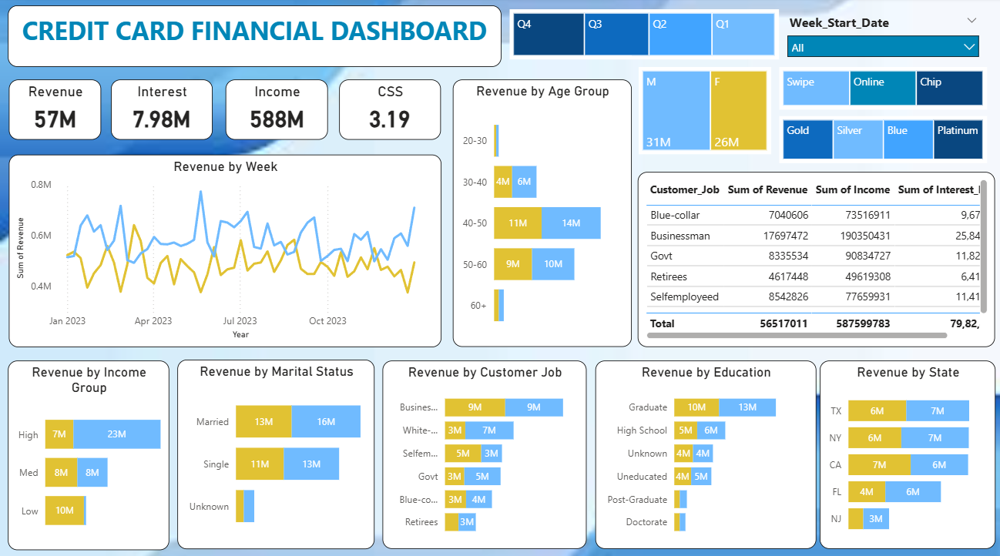
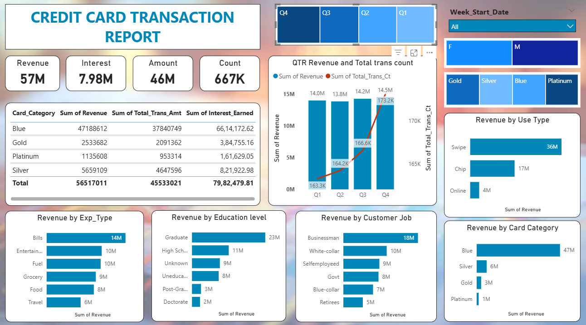

# 💳 Credit Card Financial Dashboard

> **Weekly financial analytics dashboard tracking $57M in credit card revenue across customer demographics and transaction behavior**

## 📸 Dashboard Preview

### Customer Dashboard


### Transaction Dashboard


[](https://powerbi.microsoft.com/)
[](https://www.mysql.com/)
[](https://dax.guide/)
[](https://www.microsoft.com/en-us/microsoft-365/excel)

---

## 📌 Project Overview

An end-to-end Business Intelligence solution built to help a credit card company monitor weekly financial performance and customer behavior. The project delivers two executive-level Power BI dashboards — one focused on **customer demographics** and one on **transaction activity** — enabling stakeholders to track revenue, identify high-value segments, and manage risk on a weekly basis.

**Pipeline:** Excel (validation) → MySQL (storage) → Power BI (modeling + dashboards)

**Dataset:** `customer.csv` + `credit_card.csv` — 10,109 records each | Full Year 2023

---

## 🎯 Business Problem

The company needed a centralized weekly reporting system to answer:
- How is revenue trending week over week across quarters?
- Which customer segments (age, income, job, education) drive the most revenue?
- Which card categories and expense types contribute most to transactions?
- What are the card activation and delinquency rates?

---

## 📊 Key Metrics (Full Year 2023)

| Metric | Value |
|--------|-------|
| Total Revenue | $57M |
| Total Transaction Amount | $46M |
| Total Interest Earned | $7.98M |
| Total Transactions | 667K |
| Customer Satisfaction Score | 3.19 / 5 |

---

## 📈 Dashboard 1 — Customer Dashboard

**What it shows:** Revenue broken down by customer profile — age, gender, income, job, education, marital status, and state.

**Key Findings:**

- **Gender:** Male customers contributed $31M vs Female $26M, with both segments filterable by quarter and card type.
- **Age Group:** The 40–50 age bracket is the highest revenue segment ($14M), followed by 50–60 ($10M) and 30–40 ($6M). The 60+ group shows minimal contribution — a potential underserved segment.
- **Income Group:** High-income customers dominate at $23M. Medium sits at $8M each side, and Low-income contributes $10M.
- **Marital Status:** Married customers generate more revenue ($16M + $13M) vs Single ($13M + $11M).
- **Customer Job:** Businessmen lead at $9M + $9M, followed by White-collar ($7M + $3M) and Government ($5M + $3M).
- **Education:** Graduates are the top segment at $13M + $10M, followed by High School at $6M + $5M.
- **State:** TX and NY each contribute ~$7M, CA ~$6–7M. FL and NJ follow at $4–6M.
- **Weekly Trend:** Revenue stays consistently between $0.4M–$0.8M throughout 2023, with peaks in mid-year and Q4.

---

## 📈 Dashboard 2 — Transaction Dashboard

**What it shows:** Revenue broken down by card category, expense type, transaction method, and quarterly trend.

**Key Findings:**

- **Card Category:** Blue card dominates with $47M in revenue out of $57M total. Silver adds $6M. Gold ($3M) and Platinum ($1M) are significantly underutilized.
- **Quarterly Trend:** Revenue grew steadily — Q1: $14M → Q2: $13.8M → Q3: $14.2M → Q4: $14.5M. Transaction count rose from 163.3K to 173.2K, confirming consistent year-long growth.
- **Expense Type:** Bills ($14M) is the top spending category, followed by Entertainment ($10M), Fuel ($10M), Grocery ($9M), Food ($8M), and Travel ($6M).
- **Transaction Method:** Swipe dominates at $36M, Chip at $17M, and Online at just $4M.
- **Education:** Graduates lead transactions at $23M, High School at $11M, Uneducated at $8M.
- **Customer Job:** Businessmen generate the most at $18M, followed by White-collar ($10M), Self-employed ($9M), Govt ($8M), Blue-collar ($7M), and Retirees ($5M).

---

## 💡 Business Recommendations

1. **Blue → Silver Upgrade Campaign** — Blue card generates 83% of all revenue. Targeting top Blue spenders for Silver upgrades can increase annual fee revenue significantly.
2. **Improve CSS (3.19 → 3.5+)** — Below-average satisfaction is a retention risk. Quick wins: simplify rewards redemption and improve mobile app responsiveness.
3. **Grow Online Transactions** — Online sits at just $4M vs Swipe's $36M. Incentivizing digital payments with bonus rewards could shift behavior and reduce processing costs.
4. **Target the 40–50 Age Bracket** — Highest revenue age group. Tailored offers (family cashback, travel rewards) can deepen engagement further.
5. **Expand in FL and NJ** — Both states show solid revenue ($4–6M) with headroom to grow compared to the TX/NY/CA top tier.

---

## 🛠️ Technical Workflow

```
Excel → Data validation (duplicates, nulls, date formats)
    ↓
MySQL (ccdb database)
    ├── cc_detail   — 10,109 transaction records
    └── cust_detail — 10,109 customer records
    ↓
Power BI
    ├── Relationship: cust_detail[Client_Num] → cc_detail[Client_Num]
    ├── DAX Calculated Columns (AgeGroup, IncomeGroup, week_num2)
    ├── DAX Measures (Revenue, WoW%, Activation Rate, Delinquency Rate)
    └── 2 Interactive Dashboards with slicers (Quarter, Gender, Card Type, Week)
```

---

## 🧮 Key DAX Measures

**Revenue**
```dax
Revenue = 
'cc_detail'[Annual_Fees] + 
'cc_detail'[Total_Trans_Amt] + 
'cc_detail'[Interest_Earned]
```

**Week-over-Week Revenue Change**
```dax
WoW_Revenue_Change = 
DIVIDE(
    [Current_week_Revenue] - [Previous_week_Revenue],
    [Previous_week_Revenue], 0
) * 100
```

**Age Group Segmentation**
```dax
AgeGroup = 
SWITCH(
    TRUE(),
    'cust_detail'[Customer_Age] < 30, "20-30",
    'cust_detail'[Customer_Age] < 40, "30-40",
    'cust_detail'[Customer_Age] < 50, "40-50",
    'cust_detail'[Customer_Age] < 60, "50-60",
    "60+"
)
```

**Income Group Segmentation**
```dax
IncomeGroup = 
SWITCH(
    TRUE(),
    'cust_detail'[Income] < 35000, "Low",
    'cust_detail'[Income] < 70000, "Med",
    'cust_detail'[Income] >= 70000, "High",
    "unknown"
)
```

---

## 📂 Project Structure

```
Credit-Card-Financial-Dashboard/
│
├── credit_card.csv                                       # Transaction records
├── customer.csv                                          # Customer profiles
├── cc_add.csv                                            # Weekly transaction updates
├── cust_add.csv                                          # Weekly customer updates
│
├── Credit_card.sql                                       # MySQL schema
│
├── CC_Customer.png                                       # Customer dashboard screenshot
├── Transactions.png                                      # Transaction dashboard screenshot
│
├── Credit_Card_Financial_Weekly_Dashboard_Report.pdf     # Transaction dashboard (PDF)
├── Credit_Card_report-Customer.pdf                       # Customer dashboard (PDF)
│
└── README.md
```

---

## ⚙️ How to Run This Project

**Prerequisites:** MySQL Workbench, Power BI Desktop (free), Excel

**Step 1 — MySQL Setup**
```sql
CREATE DATABASE ccdb;
USE ccdb;
-- Run Credit_card.sql to create both tables
```

**Step 2 — Import Data**
Right-click each table in MySQL Workbench → Table Data Import Wizard → Select CSV → Import

```sql
-- Verify import
SELECT COUNT(*) FROM cc_detail;     -- Expected: 10,109
SELECT COUNT(*) FROM cust_detail;   -- Expected: 10,109
```

**Step 3 — Connect Power BI**
Home → Get Data → MySQL Database → Server: `localhost` → Database: `ccdb` → Import both tables

**Step 4 — Data Model**
Create relationship: `cust_detail[Client_Num]` → `cc_detail[Client_Num]` (One-to-Many)

**Step 5 — DAX + Dashboards**
Add the DAX measures above, then build visuals using the dashboard screenshots as reference.

> Just want to view the output? Open the PDF files directly — no setup needed.

---

## 🎓 Skills Demonstrated

- **MySQL** — Database design, schema creation, CSV import, data validation
- **Power BI** — Data modeling, relationships, interactive dashboards, slicers
- **DAX** — Calculated columns, measures, time intelligence (WoW), SWITCH segmentation
- **Business Analytics** — Customer segmentation, revenue breakdown, risk monitoring
- **Data Storytelling** — Translating raw transaction data into executive-ready insights

---

## 📁 Dataset

- **Source:** `customer.csv` and `credit_card.csv`
- **Period:** Full Year 2023 (Jan – Dec, 53 weeks)
- **Records:** 10,109 transactions × 10,109 customers
- **Key Fields:** Card category, transaction amount, expense type, income, age, job, state, delinquency status

---

## 🤝 Connect With Me

**Nihar Toor**

[](https://github.com/Niharricky)

---

*Last Updated: January 2026*
